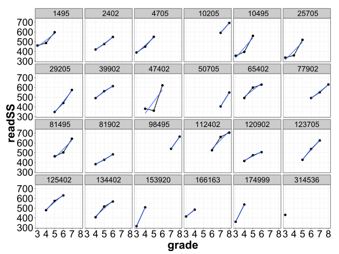
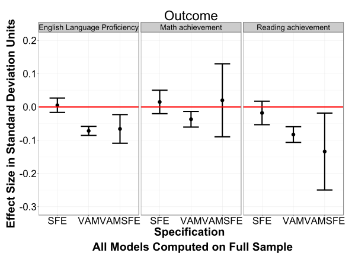
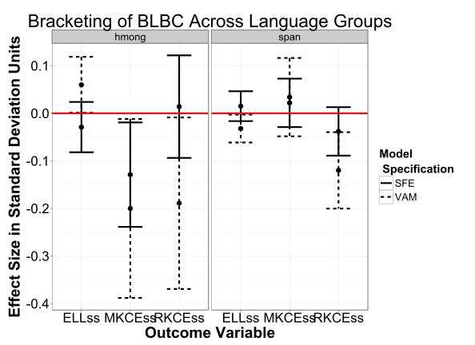

% Using R and Longitudinal Data System Records to Answer Policy Questions
% Jared Knowles

# Overview
- Why R?
- Examples of R Analyses?
- Share R code across states
- Develop joint methods
- Produce reports


# Why R?
- R is free
- R is open source
- R is **best in class** and state of the art
- R is free

# R works for government
- R is transparent
- R is reproducible
- R is accurate
- R works! Today!

# R
<p align="center"></p>

# Google Scholar Hits
R has recently passed Stata on Google Scholar hits and it is catching up to the two major players SPSS and SAS

<p align="center"></p>

# R Has an Active Web Presence
R is linked to from more and more sites 

<p align="center"></p>

# R Extensions
These links come from the explosion of add-on packages to R

<p align="center"></p>

# R Has an Active Community 
Usage of the R listserv for help has really exploded recently

<p align="center"></p>


# R Examples
Read in Data


```r
studat <- read.csv("data/smalldata.csv")
str(studat[, 24:32])
```

```
## 'data.frame':	2700 obs. of  9 variables:
##  $ schoolscore: num  29.2 56 56 56 56 ...
##  $ district   : int  3 3 3 3 3 3 3 3 3 3 ...
##  $ schoolhigh : int  0 0 0 0 0 0 0 0 0 0 ...
##  $ schoolavg  : int  1 1 1 1 1 1 1 1 1 1 ...
##  $ schoollow  : int  0 0 0 0 0 0 0 0 0 0 ...
##  $ readSS     : num  357 264 370 347 373 ...
##  $ mathSS     : num  387 303 365 344 441 ...
##  $ proflvl    : Factor w/ 4 levels "advanced","basic",..: 2 3 2 2 2 4 4 4 3 2 ...
##  $ race       : Factor w/ 5 levels "A","B","H","I",..: 2 2 2 2 2 2 2 2 2 2 ...
```

```r
# source('data/simulate_data.R')
```


# Simple Diagnostics


```r
source("ggplot2themes.R")
library(ggplot2)
qplot(readSS, mathSS, data = studat, alpha = I(0.2)) + geom_smooth(aes(group = ell, 
    color = factor(ell))) + theme_dpi()
```

 


# Advanced Diagnostics


```r
samp <- sample(studat$stuid, 24)
plotsub <- subset(studat, stuid %in% samp)
qplot(grade, readSS, data = plotsub) + facet_wrap(~stuid, nrow = 4, 
    ncol = 6) + theme_dpi() + geom_line() + geom_smooth(method = "lm", se = FALSE)
```

 


# More Advanced 
<p align="center"></p>

# Can this generate information?
- Graphics help explain, but are still descriptive
- R can help on two fronts:
  1. R can do advanced analytics that provide insight
  2. R can graphically depict those analytics in simple ways that are intuitive to policy makers
- Oh yeah...? Prove it.
  1. BLBC study in Wisconsin
  2. Regression Trees
  3. Machine Learning Algorithms


# BLBC in Wisconsin
- We fit statistical models to all the ESL students in Wisconsin modeling their future test score as best as possible through each strategy described above (on all three major assessments)
- We also include an indicator of whether the student was **eligible** for BLBC instruction or not
- We compare to see if the average student receiving BLBC did better than the average student receiving other ESL services, all else equal
- We report the range of uncertainty around this difference between student groups and compare them to see if any meaningful differences emerge
- Due to our large sample size we expect our results to be biased in favor of finding statistically significant results, so we also examine the magnitude of findings to see if they are **substantively significant**; i.e. is the difference big enough to matter in the lives of students?


# Evaluations of Policy 
- Results are presented in effect sizes, or standard deviation units of change in test scores.
- **0.1** is small, 0.2 to 0.4 is reasonable and is about a *year* of education in most cases. Bigger than 0.4 is huge.

# Results I
- The bars represent the 95% confidence interval around the estimate. The VAM model is consistently statistically significant, not overlapping 0, and negative.
- The length of the bars represent the uncertainty about the estimate.
- But the mean effect size is quite small, less than 0.1 standard deviations in most cases. 
- This represents a year-to-year change in a student's score between BLBC and non-BLBC instruction.
 


# Results II
- Language is different. Wisconsin has a large sample of both Hmong and Spanish speakers and they have different results when analyzed separately
 

- BLBC has no effect for Spanish speakers on math, but a large negative effect for Hmong speakers
- BLBC may be slightly negative for reading among SPanish speakers, but not for Hmong speakers
- BLBC may be slightly positive for English proficiency for Hmong speakers and not for Spanish speakers
- More precision is needed

# Conclusions and Next Steps
- In Wisconsin BLBC does not have the **negative** effects found in recent research on California, though a slight negative effect may exist in some cases
- Unlike other states where BLBC has been studied, Wisconsin has substantially different results between language groups on mathematics and possibly on English proficiency achievement
- There is still a lot of imprecision in the estimates used here and more precision would be helpful, but effects are not substantively large in terms of relative student performance, even in the upper and lower bounds

# Next Steps
- Get more data over more years and use a more precise estimation technique to reduce uncertainty about effects
- Explore the **variation** across BLBC programs in addition to the mean effect
- Learn more about the non-cognitive non-academic outcomes for BLBC in order to understand the costs and benefits of BLBC programs more fully
- Estimate a "treatement-on-the-treated"" parameter to more directly compare to prior research
- Survey teachers and merge teacher/program practice data with student outcomes to begin exploring the effective components of BLBC and ESL programs


# Inference Trees
- Inference trees allow for ranking and ordering of effects by magnitude
- Bin students into groups of attributes and deviation in outcome measure from other students with other attribute groups
- Very useful for policy making and program targeting
- Incredibly easy to implement in R and to visually depict / make actionable
- Can simply display very complex interactions between demographic attributes and test outcomes
- Let's look at an example on simulated student test score data

# Inference Tree Example


```r
library(partykit)
mypar <- ctree_control(testtype = "Bonferroni", mincriterion = 0.99)
mytree <- ctree(mathSS ~ race + econ + ell + disab + sch_fay + dist_fay + 
    attday + readSS, data = subset(studat, grade == 3))
plot(mytree)
```

 


# R is a powerful platform

**Can Standardize and Share / Compare Results**

- Execute the same code on each other's data
- Compare results
- Compare methods of analysis and improve them
- Build a professional community 
- Collaborate

# Code collaboration example
- There are a number of very common data tasks to help do policy research that can be shared 
  - Clean data
  - Combine datasets and match data
  - Calculate basic statistics (duration, etc.)
  - Flag abnormal values
  - Create diagnostic reports (with graphics)

# Some code sharing exists
- DPI has begun working with the [Strategic Data Project](http://www.gse.harvard.edu/~pfpie/index.php/sdp/strategic-data-project-the-vision) at Harvard to prepare their toolkit using R
  - Currently written in Stata
- Goal is to package the toolkit into R functions that can be applied to any dataset that has the required elements
- This work has begun with the creation of a few functions in R and some documentation
- Can be found [online at GitHub](https://github.com/jknowles/SDP-Toolkit-for-R)
<p align="center"></p>

# Race/Ethnicity Example
- Consider this example data from the Strategic Data Projct Toolkit:


```
##   sid school_year race_ethnicity
## 1   1        2004              B
## 2   1        2005              H
## 3   1        2006              H
## 4   1        2007              H
## 5   2        2006              W
## 6   2        2007              B
```


- Student 1 and Student 2 in this data have different races in different years
- This doesn't happen often in most of our data systems, but it does happen, especially across different datasets
- For research this can cause problems and requires different business rules

# What business rules do we use?
- Ad hoc and up to the researcher
- Need standards
- Need commonality
- Need consistency
- Need tools that make those things easy to do!

# What to do?


```r
head(stuatt, 4)
```

```
##   sid school_year race_ethnicity
## 1   1        2004              B
## 2   1        2005              H
## 3   1        2006              H
## 4   1        2007              H
```


- Should this student be declared H, the modal race?
- Should this student be declared B, the first occurring race?
- Should this student be flagged as inconsisent?
- Should this student be coded as multi-racial?

# Fix the data


```r
stuatt$race2 <- stuatt$race_ethnicity
stuatt$race2[[1]] <- "H"
head(stuatt, 4)
```

```
##   sid school_year race_ethnicity race2
## 1   1        2004              B     H
## 2   1        2005              H     H
## 3   1        2006              H     H
## 4   1        2007              H     H
```


- We can do the modal category easily in R using a simple function:


```r
statamode <- function(x) {
    z <- table(as.vector(x))
    m <- names(z)[z == max(z)]
    if (length(m) == 1) {
        return(m)
    }
    return(".")
}
```


# Fixing data in a few simple steps


```r
require(plyr)
modes <- ddply(stuatt, .(sid), summarize, race_temp = statamode(race_ethnicity), 
    nvals = length(unique(race_ethnicity)), most_recent_year = max(school_year), 
    most_recent_race = tail(race_ethnicity, 1))

modes$race2[modes$race_temp != "."] <- modes$race_temp[modes$race_temp != 
    "."]

modes$race2[modes$race_temp == "."] <- as.character(modes$most_recent_race[modes$race_temp == 
    "."])

stuatt2 <- merge(stuatt, modes)
stuatt2$race_ethnicity <- stuatt2$race2
stuatt2 <- subset(stuatt2, select = c("sid", "school_year", "race_ethnicity"))
```


# Results


```r
head(stuatt)
```

```
##   sid school_year race_ethnicity race2
## 1   1        2004              B     H
## 2   1        2005              H     H
## 3   1        2006              H     H
## 4   1        2007              H     H
## 5   2        2006              W     W
## 6   2        2007              B     B
```

```r
head(stuatt2)
```

```
##   sid school_year race_ethnicity
## 1   1        2004              H
## 2   1        2007              H
## 3   1        2006              H
## 4   1        2005              H
## 5 100        2005              A
## 6 100        2006              A
```


# What happened?
- We implemented two business rules on over 59,000 observations in a few seconds on a few lines of code
  - First, the modal race is chosen for multiple race categories per student
  - If a tie exists (more than 1 mode), we map the most recent race
- These business rules can be readily changed, i.e. we could use the first race or a multi-race code for students with multiple modes
- This script can be run every time data is extracted from the warehouse to do work on 
- It can be run by every analyst on every machine because R is free and easy to deploy! Consistency and repeatability.
- It can be swapped out with a different business rule implemented just as easily for different purposes **flexibility**
- It can be mapped and translated onto CEDS elements

# Next Steps
- Once we clean up the data, analytics can be shared
- Doing analytics is a simple next step in R
- R has best in class machine learning algorithms used to classify data and predict
- R is the tool of choice for data science algorithms

# A Data Mining Example
- If we are interested in pure predictive analytics, R provides hundreds of best in class algorithms and methods to evaluate them
- This is done primarily through the `caret` package, which provides an easy to use framework for comparing these algorithms
- These models can be used to predict "classes" of students, predict student scores, or predict anything else of interest


# Do analytics on fixed data


```r
# Set aside test set
testset <- sample(unique(student_long$stuid), 190000)
student_long$case <- 0
student_long$case[student_long$stuid %in% testset] <- 1
# Draw a training set of data (random subset of students)
training <- subset(student_long, case == 0)
testing <- subset(student_long, case == 1)

training <- training[, c(3, 6:16, 21, 22, 28, 29, 30)]  # subset vars
trainX <- training[, 1:15]

# Parameters
ctrl <- trainControl(method = "repeatedcv", number = 15, repeats = 5, 
    summaryFunction = defaultSummary)
# Search grid
grid <- expand.grid(.interaction.depth = seq(2, 6, by = 1), .n.trees = seq(200, 
    800, by = 50), .shrinkage = c(0.01, 0.1))
# Boosted tree search
gbmTune <- train(x = trainX, y = training$mathSS, method = "gbm", 
    metric = "RMSE", trControl = ctrl, tuneGrid = grid, verbose = FALSE)
gbmPred <- predict(gbmTune, testing[, names(trainX)])

# svmTune<-train(x=trainX, y=training$mathSS, method='svmLinear',
# tuneLength=3, metric='RMSE', trControl=ctrl)
```


# Machine Learning


```r
# plot(gbmTune)
```


<p align="center"></p>

# Predictions

<p align="center"></p>


```r
## qplot(testing$mathSS,gbmPred,geom='hex',binwidth=c(10,10))+geom_smooth()+theme_dpi()
```


# Deviance


```r
## qplot(testing$mathSS,testing$mathSS-gbmPred,geom='hex',binwidth=c(10,10))+# geom_smooth()+theme_dpi()
```


<p align="center"></p>


# Deviance (II)


```r
# qplot(testing$mathSS-gbmPred,binwidth=7)+theme_dpi()+xlim(c(-60,60))
```


<p align="center"></p>

# The best part
- R is a programming language and can be used to produce reports
- R can produce HTML, PDF, or other formats of reports
- Examples:
  * Dropout risk reports for each high school
  * NSC reports by school district
- R can do this by simply building a template and running analytics on the appropriate data subset, automatically
  * R can even e-mail reports, seriously
- Your data analysts have access to a full programming language once they understand R, flexibility far above and beyond other analytics packages for a slightly steeper learning curve

# How to learn?
- Online with tutorials
- DPI R Bootcamp in August
- PD workshops elsewhere

# Online Tutorials
- Visit this presenation online and look at these great resources for learning that are free and open source as well
- [R Features List](http://www.revolutionanalytics.com/what-is-open-source-r/r-language-features/)
- [Video Tutorials](http://www.twotorials.com/)
- [R Tutorials from Around the World](http://pairach.com/2012/02/26/r-tutorials-from-universities-around-the-world/)
- [R for SPSS/SAS Users](http://r4stats.com/add-ons)

# DPI R Bootcamp
- DPI is offering a bootcamp on R August 2nd and 3rd. 
- Slots are limited for this two full days of R training.
- Training materials will be made available online. As they are developed, they can be [viewed at https://github.com/jknowles/r_tutorial_ed.](https://github.com/jknowles/r_tutorial_ed) 
- For more information, visit the [website https://sites.google.com/a/dpi.wi.gov/rbootcamp/.](https://sites.google.com/a/dpi.wi.gov/rbootcamp/)
  * We will probably do another bootcamp soon, a few slots still available for this bootcamp. Interested? See me.

# Questions
- This presentation will be available online at [www.jaredknowles.com](www.jaredknowles.com) tomorow. It is on GitHub (along with all the data and code to recreate all the charts and graphs) at [www.github.com/jknowles/statsdc12-presentation](www.github.com/jknowles/statsdc12-presentation)
- You can get the links and more information there
- Feel free to contact me
  - E-mail: jared.knowles@dpi.wi.gov
  - Twitter: @jknowles
  - Website: www.jaredknowles.com
  - Github: jknowles

# Discussion
- There will be a lunch session about the broader topic of how to build an analytics workflow into your SEA/LEA that leverages various strategies to get more out of your data
  - Tomorrow, at lunch time, room TBA. R
- R is part of this package potentially, but not the sole solution, and a broader set of policy issues is required to be discussed
- Questions? Thoughts? Issues? Worries? Complaints?
  * And yes, useRs are very passionate about the tool :-)

# Session Info
- Questions?

This document is produced with **knitr** version `0.6.3`. Here is my session info:


```r
print(sessionInfo(), locale = FALSE)
```

```
## R version 2.15.0 (2012-03-30)
## Platform: i386-pc-mingw32/i386 (32-bit)
## 
## attached base packages:
## [1] grid      stats     graphics  grDevices utils     datasets  methods  
## [8] base     
## 
## other attached packages:
## [1] plyr_1.7.1     foreign_0.8-49 partykit_0.1-4 mgcv_1.7-13   
## [5] ggplot2_0.9.1  gridExtra_0.9  knitr_0.6.3   
## 
## loaded via a namespace (and not attached):
##  [1] colorspace_1.1-1   dichromat_1.2-4    digest_0.5.2      
##  [4] evaluate_0.4.2     formatR_0.5        labeling_0.1      
##  [7] lattice_0.20-6     MASS_7.3-17        Matrix_1.0-6      
## [10] memoise_0.1        munsell_0.3        nlme_3.1-103      
## [13] parser_0.0-15      proto_0.3-9.2      RColorBrewer_1.0-5
## [16] Rcpp_0.9.10        reshape2_1.2.1     scales_0.2.1      
## [19] splines_2.15.0     stringr_0.6        survival_2.36-12  
## [22] tools_2.15.0      
```


